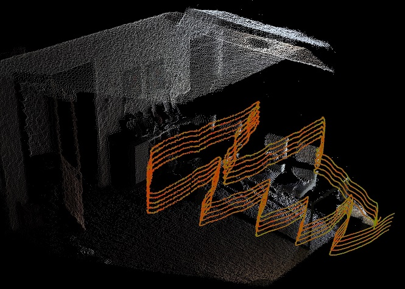
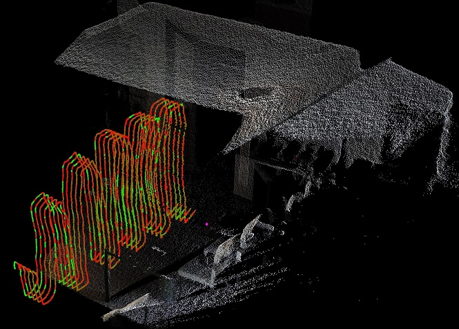

# 3D Wi-Fi Scanner
A system to collect Wi-Fi signal strength in 3D using an Xbox Kinect Sensor v2 and ESP8266 microcontrollers. Originally hosted on [eng-git](https://eng-git.canterbury.ac.nz/mka122/cosc428-2018).

## Output
<table>
<td>

</td>
<td>

</td>
</table>

## System Structure
### Projects
The data-collection system consists of the following two projects:
* `WiFiMapper` - the program to be run on the host machine.
* `SignalStrengthServer` - the program to be run on an ESP8266 microcontroller.

Please see the readme files in the corresponding directories for more information.

### Additional Files
The `./Data` directory contains sample heatmaps, and the python script used to perform an uncertainty propagation calculation for the position of the ESP8266 microcontrollers.

## Authors
**Marc Katzef** - mka122@uclive.ac.nz